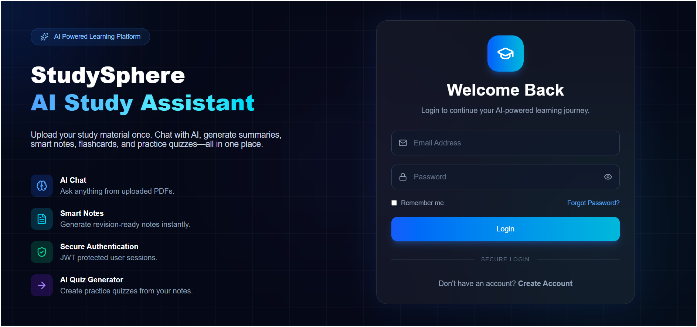
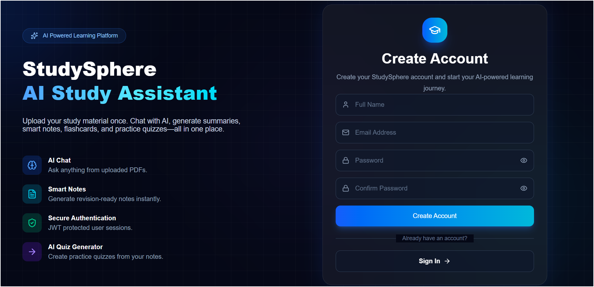
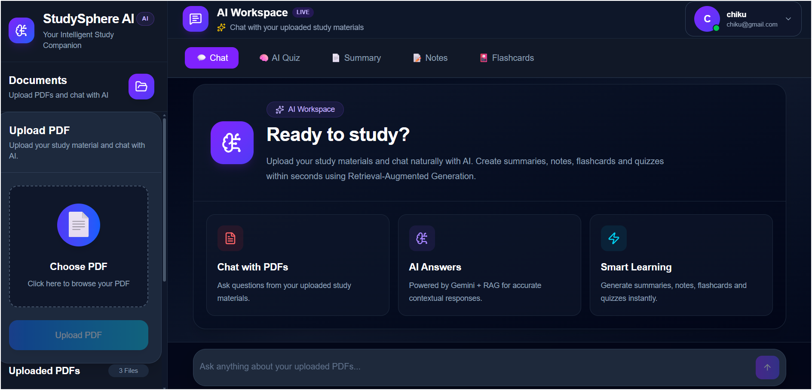
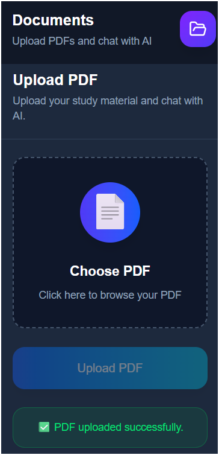
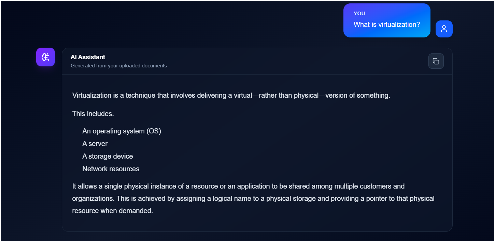
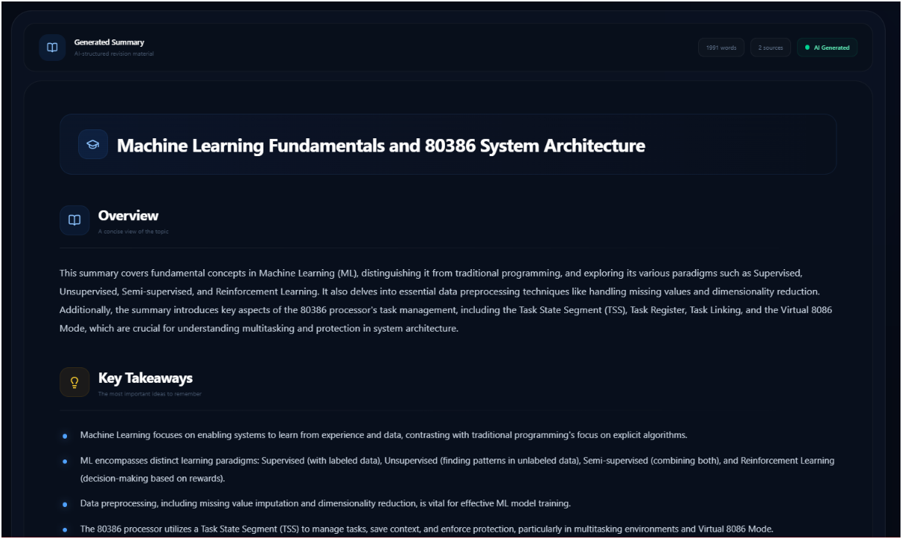
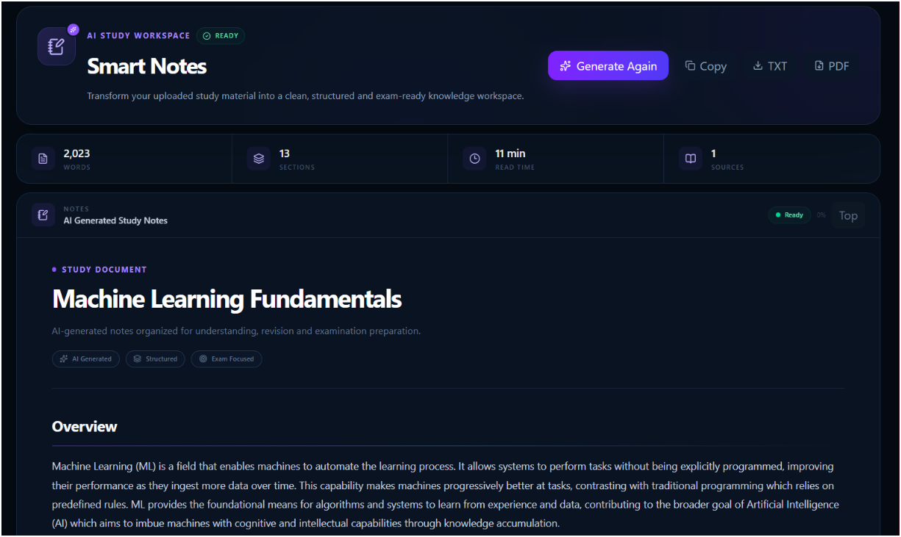
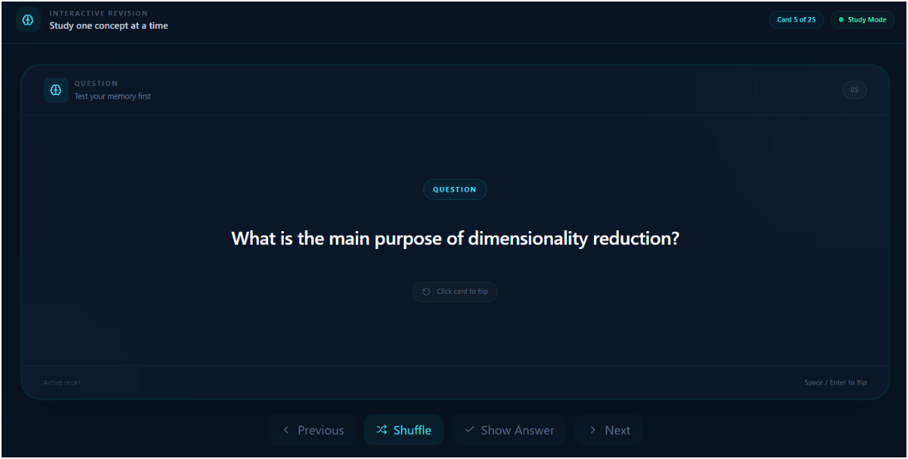
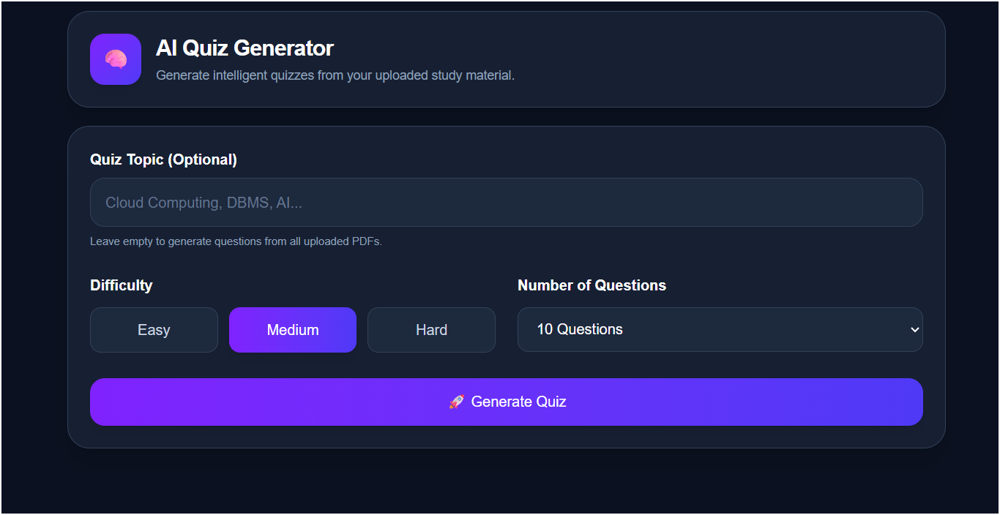
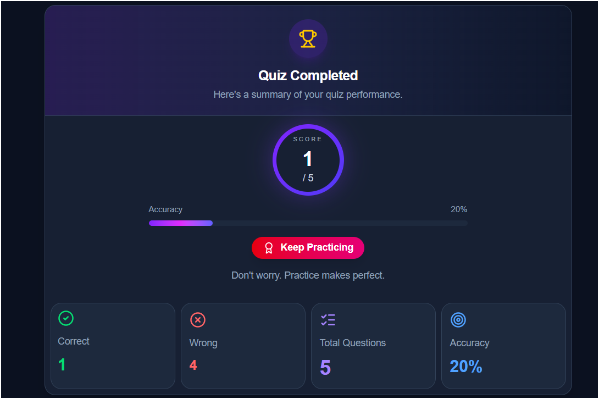

<div align="center">

# ✦ StudySphere AI Assistant

### Your AI-powered study workspace for understanding, revising, and mastering documents.

**Transform static PDFs into an interactive learning experience with AI-powered chat, summaries, notes, flashcards, and quizzes.**

<br />

[](https://github.com/jarvissi18/StudySphere-AI-Assistant)
[](LICENSE)

<br />


<br />

**Built with React · FastAPI · RAG · ChromaDB · Google Gemini**

</div>

---

## ✨ What is StudySphere?

**StudySphere AI Assistant** is a full-stack AI learning platform that turns your study documents into an intelligent, interactive workspace.

Instead of manually reading a PDF, creating notes, preparing questions, and revising everything yourself, StudySphere lets you interact directly with your study material using AI.

Upload your document → let StudySphere understand it → learn from it.

### With StudySphere, you can:

* 💬 **Chat with your study material**
* 📄 **Upload and process PDF documents**
* 📝 **Generate structured summaries**
* 📚 **Create exam-oriented notes**
* 🧠 **Generate interactive flashcards**
* 🎯 **Create AI-powered quizzes**
* 📊 **Review quiz performance**
* 🔐 **Manage your account securely**

The core AI experience is powered by **Retrieval-Augmented Generation (RAG)**, allowing relevant document content to be retrieved before generating responses with Google Gemini.


# 🎯 Why StudySphere?

Traditional study workflows require students to switch between multiple tools.

| Traditional Workflow         | StudySphere                |
| ---------------------------- | -------------------------- |
| 📖 Read the entire PDF       | 🤖 Ask AI directly         |
| ✍️ Write notes manually      | 📝 Generate notes          |
| 📄 Create summaries yourself | ⚡ AI-generated summaries   |
| 🧠 Make flashcards manually  | 🎴 Generate flashcards     |
| ❓ Prepare MCQs manually      | 🎯 AI-generated quizzes    |
| 🔍 Search through pages      | 💬 Ask questions naturally |
| 🔄 Use multiple study tools  | ✦ One AI study workspace   |

> **StudySphere is designed to reduce the friction between studying and understanding.**

---

# ✨ Core Features

## 💬 AI Document Chat

Ask questions about your uploaded study material and receive context-aware answers.

**Powered by:**

* Retrieval-Augmented Generation
* Semantic document search
* Vector embeddings
* Google Gemini
* Context-aware prompting

---

## 📄 Intelligent PDF Processing

Upload your study material and let the backend prepare it for AI interaction.

### Processing pipeline

```text
PDF
 │
 ▼
Text Extraction
 │
 ▼
Text Chunking
 │
 ▼
Embedding Generation
 │
 ▼
ChromaDB
 │
 ▼
Semantic Retrieval
```

---

## 📝 AI Summaries

Convert lengthy study material into concise revision-friendly summaries.

Generated content can include:

* Key concepts
* Important points
* Definitions
* Explanations
* Advantages & disadvantages
* Quick revision material

---

## 📚 AI Notes

Generate structured notes directly from your uploaded material.

Designed for:

* Exam preparation
* Topic-wise revision
* Quick learning
* Concept understanding
* Last-minute revision

---

## 🧠 AI Flashcards

Turn study material into interactive question-and-answer cards.

Useful for:

* Active recall
* Self-testing
* Memory retention
* Quick revision

---

## 🎯 AI Quiz

Generate quizzes from your study material.

### Quiz experience

* Multiple-choice questions
* Answer selection
* Automatic scoring
* Result review
* Performance feedback

---

## 🔐 Authentication & Security

StudySphere includes a dedicated authentication layer with:

* User registration
* User login
* JWT-based authentication
* Protected routes
* Password hashing
* Environment-based secrets

---

# 🖥️ Application Preview

> Screenshots are stored inside the `/docs` directory of the repository.

### 🔐 Authentication

<p align="center">

</p>

<p align="center"><sub>Secure user authentication</sub></p>

---

### 📝 Registration

<p align="center">

</p>

---

### 🏠 Dashboard

<p align="center">

</p>

---

### 📂 PDF Upload

<p align="center">

</p>

---

### 💬 AI Chat

<p align="center">

</p>

---

### 📝 AI Summary

<p align="center">

</p>

---

### 📚 AI Notes

<p align="center">

</p>

---

### 🧠 AI Flashcards

<p align="center">

</p>

---

### 🎯 AI Quiz

<p align="center">

</p>

---

### 📊 Quiz Results

<p align="center">

</p>

---

# 🏗️ Architecture

StudySphere follows a modern full-stack architecture combining a React frontend, FastAPI backend, vector search, and generative AI.

```text
                         ┌─────────────────────┐
                         │       STUDENT       │
                         └──────────┬──────────┘
                                    │
                                    ▼
                         ┌─────────────────────┐
                         │    React + Vite     │
                         │    Tailwind CSS     │
                         └──────────┬──────────┘
                                    │
                              REST / Axios
                                    │
                                    ▼
                         ┌─────────────────────┐
                         │      FastAPI        │
                         │      Backend        │
                         └──────────┬──────────┘
                                    │
              ┌─────────────────────┼─────────────────────┐
              │                     │                     │
              ▼                     ▼                     ▼
       ┌─────────────┐      ┌──────────────┐      ┌──────────────┐
       │     Auth    │      │ PDF Pipeline │      │  AI Services │
       └──────┬──────┘      └──────┬───────┘      └──────┬───────┘
              │                    │                     │
              ▼                    ▼                     ▼
       ┌─────────────┐      ┌──────────────┐      ┌──────────────┐
       │    SQLite   │      │   ChromaDB   │      │ Google Gemini│
       └─────────────┘      └──────────────┘      └──────────────┘
```

---

# 🧠 RAG Architecture

The AI chat system uses **Retrieval-Augmented Generation** to ground responses in uploaded study material.

```text
                    DOCUMENT INGESTION
                           │
                           ▼
                     Upload PDF
                           │
                           ▼
                    Extract Text
                           │
                           ▼
                    Split into Chunks
                           │
                           ▼
                  Generate Embeddings
                           │
                           ▼
                     Store Vectors
                           │
                           ▼
                       ChromaDB
                           │
                           │
                    ───────┼───────
                           │
                           ▼
                    USER QUESTION
                           │
                           ▼
                  Generate Query Embedding
                           │
                           ▼
                    Semantic Search
                           │
                           ▼
                 Retrieve Relevant Chunks
                           │
                           ▼
                 Build Context + Prompt
                           │
                           ▼
                     Google Gemini
                           │
                           ▼
                  Contextual AI Response
```

### Why RAG?

RAG allows the application to retrieve relevant information from the user's documents before generating an answer.

This makes the AI experience more document-focused than a generic chatbot.

---

# ⚙️ Technology Stack

## Frontend

| Technology         | Role                           |
| ------------------ | ------------------------------ |
| **React.js**       | Component-based user interface |
| **Vite**           | Development and build tooling  |
| **Tailwind CSS**   | Responsive UI styling          |
| **Axios**          | API communication              |
| **React Markdown** | Markdown response rendering    |
| **jsPDF**          | PDF export                     |
| **Lucide React**   | Interface icons                |

## Backend

| Technology   | Role               |
| ------------ | ------------------ |
| **Python**   | Backend language   |
| **FastAPI**  | REST API framework |
| **Uvicorn**  | ASGI server        |
| **Pydantic** | Data validation    |
| **JWT**      | Authentication     |
| **Passlib**  | Password hashing   |

## AI & Retrieval

| Technology                | Role                     |
| ------------------------- | ------------------------ |
| **Google Gemini**         | Generative AI            |
| **ChromaDB**              | Vector database          |
| **Sentence Transformers** | Embeddings               |
| **RAG**                   | Context-aware generation |

## Data

| Technology   | Role                    |
| ------------ | ----------------------- |
| **SQLite**   | Application/user data   |
| **ChromaDB** | Document vector storage |

---

# 📂 Project Structure

```text
StudySphere-AI-Assistant/
│
├── backend/
│   ├── auth/
│   ├── database/
│   ├── routes/
│   ├── schemas/
│   ├── services/
│   ├── uploads/
│   ├── main.py
│   └── requirements.txt
│
├── frontend/
│   ├── public/
│   ├── src/
│   │   ├── components/
│   │   ├── context/
│   │   ├── pages/
│   │   ├── services/
│   │   └── App.jsx
│   │
│   ├── package.json
│   └── vite.config.js
│
├── docs/
│   ├── login.png
│   ├── register.png
│   ├── dashboard.png
│   ├── upload-pdf.png
│   ├── chat.png
│   ├── summary.png
│   ├── notes.png
│   ├── flashcard.png
│   ├── quiz.png
│   └── quiz-result.png
│
├── .gitignore
├── LICENSE
└── README.md
```

---

# 🚀 Getting Started

## Prerequisites

Make sure the following are installed:

* **Python 3.11+**
* **Node.js**
* **npm**
* **Git**
* A **Google Gemini API key**

---

## 1. Clone the Repository

```bash
git clone https://github.com/jarvissi18/StudySphere-AI-Assistant.git

cd StudySphere-AI-Assistant
```

---

# ⚡ Backend Setup

Navigate to the backend:

```bash
cd backend
```

### Create a virtual environment

```bash
python -m venv venv
```

### Activate the environment

#### Windows

```bash
venv\Scripts\activate
```

#### Linux / macOS

```bash
source venv/bin/activate
```

### Install dependencies

```bash
pip install -r requirements.txt
```

### Start the API server

```bash
uvicorn main:app --reload
```

Backend:

```text
http://127.0.0.1:8000
```

Interactive API documentation:

```text
http://127.0.0.1:8000/docs
```

---

# 💻 Frontend Setup

Open a new terminal.

```bash
cd frontend
```

Install dependencies:

```bash
npm install
```

Start the development server:

```bash
npm run dev
```

Frontend:

```text
http://localhost:5173
```

---

# 🔑 Environment Configuration

Create:

```text
backend/.env
```

Example:

```env
GEMINI_API_KEY=your_gemini_api_key
SECRET_KEY=your_secret_key
ALGORITHM=HS256
ACCESS_TOKEN_EXPIRE_MINUTES=60
```

### ⚠️ Security

Never commit `.env` files or API keys to GitHub.

Make sure `.env` is included in `.gitignore`.

---

# 📡 API Overview

## Authentication

| Method | Endpoint    | Purpose               |
| ------ | ----------- | --------------------- |
| `POST` | `/register` | Create account        |
| `POST` | `/login`    | Authenticate user     |
| `GET`  | `/auth/me`  | Retrieve current user |

## Documents

| Method   | Endpoint            | Purpose             |
| -------- | ------------------- | ------------------- |
| `POST`   | `/upload`           | Upload PDF          |
| `GET`    | `/files`            | List uploaded files |
| `DELETE` | `/delete-file/{id}` | Delete document     |

## AI

| Method | Endpoint               | Purpose             |
| ------ | ---------------------- | ------------------- |
| `POST` | `/ask`                 | Ask questions       |
| `POST` | `/generate-summary`    | Generate summary    |
| `POST` | `/generate-notes`      | Generate notes      |
| `POST` | `/generate-flashcards` | Generate flashcards |
| `POST` | `/generate-quiz`       | Generate quiz       |

> API routes may evolve as the project continues to develop. Use the FastAPI Swagger documentation at `/docs` as the runtime API reference.

---

# 🔄 End-to-End Workflow

```text
┌─────────────────┐
│   User Login    │
└────────┬────────┘
         │
         ▼
┌─────────────────┐
│   Upload PDF    │
└────────┬────────┘
         │
         ▼
┌─────────────────┐
│ Extract Content │
└────────┬────────┘
         │
         ▼
┌─────────────────┐
│ Generate Vector │
│   Embeddings    │
└────────┬────────┘
         │
         ▼
┌─────────────────┐
│    ChromaDB     │
└────────┬────────┘
         │
         ▼
┌────────────────────────────┐
│ Select Learning Experience │
│                            │
│ Chat | Summary | Notes     │
│ Flashcards | Quiz          │
└────────────┬───────────────┘
             │
             ▼
      ┌──────────────┐
      │ Gemini + RAG │
      └──────┬───────┘
             │
             ▼
      ┌──────────────┐
      │ AI Response  │
      └──────────────┘
```

---

# 📊 Feature Status

| Feature                  | Status |
| ------------------------ | :----: |
| User Authentication      |    ✅   |
| JWT Authorization        |    ✅   |
| PDF Upload               |    ✅   |
| PDF Processing           |    ✅   |
| Vector Embeddings        |    ✅   |
| ChromaDB Integration     |    ✅   |
| RAG-based AI Chat        |    ✅   |
| AI Summaries             |    ✅   |
| AI Notes                 |    ✅   |
| AI Flashcards            |    ✅   |
| AI Quizzes               |    ✅   |
| Quiz Scoring             |    ✅   |
| Responsive UI            |    ✅   |
| Live Frontend Deployment |    ✅   |

---

# 🛣️ Roadmap

StudySphere is actively evolving.

### 📚 Learning

* [ ] AI Study Planner
* [ ] Personalized learning paths
* [ ] AI revision scheduler
* [ ] Spaced repetition
* [ ] Progress tracking

### 🧠 AI

* [ ] OCR for scanned documents
* [ ] Multi-document conversations
* [ ] AI mind maps
* [ ] Better retrieval evaluation
* [ ] Personalized AI tutor

### 🖥️ Platform

* [ ] Multi-PDF workspaces
* [ ] Cloud-based document storage
* [ ] Docker support
* [ ] Production backend deployment
* [ ] Advanced analytics

---

# 🔐 Security Considerations

StudySphere follows several basic application security practices:

* JWT-based authentication
* Password hashing
* Protected API routes
* Environment-based secrets
* No API keys stored in frontend source
* `.env` excluded from version control

> For production deployment, additional controls such as HTTPS, rate limiting, secure cookie/token strategies, CORS hardening, logging, monitoring, and secret management should be implemented.

---

# 🎓 What This Project Demonstrates

StudySphere is more than a UI project. It demonstrates practical full-stack and AI engineering concepts including:

* Retrieval-Augmented Generation
* Large Language Model integration
* Vector databases
* Semantic search
* Document processing
* Embedding generation
* REST API development
* React application architecture
* Authentication & authorization
* Database integration
* AI-powered content generation
* Full-stack application development

---

# 🤝 Contributing

Contributions, suggestions, and improvements are welcome.

### Fork the project

```bash
git fork https://github.com/jarvissi18/StudySphere-AI-Assistant
```

Or use GitHub's **Fork** button.

### Create a branch

```bash
git checkout -b feature/your-feature
```

### Commit your changes

```bash
git add .

git commit -m "feat: add your feature"
```

### Push

```bash
git push origin feature/your-feature
```

Then open a Pull Request.

---

# 🧑‍💻 Author

<div align="center">

### Swapnil Suryawanshi

**Computer Engineering Student · Full-Stack Developer**

[](https://github.com/jarvissi18)

</div>

---

# 📄 License

This project is licensed under the **MIT License**.

See the [LICENSE](LICENSE) file for details.

---

# 🙏 Acknowledgements

Built with the help of amazing open-source technologies:

* [React](https://react.dev/)
* [FastAPI](https://fastapi.tiangolo.com/)
* [Vite](https://vite.dev/)
* [Tailwind CSS](https://tailwindcss.com/)
* [Google Gemini](https://ai.google.dev/)
* [ChromaDB](https://www.trychroma.com/)
* [Sentence Transformers](https://www.sbert.net/)
* [Lucide](https://lucide.dev/)

---

<div align="center">

# ✦ StudySphere AI Assistant

### Learn smarter. Revise faster. Understand better.

<br />


</div>
