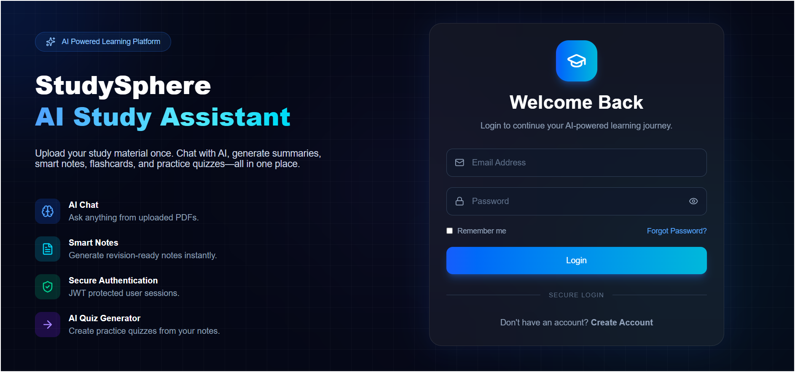
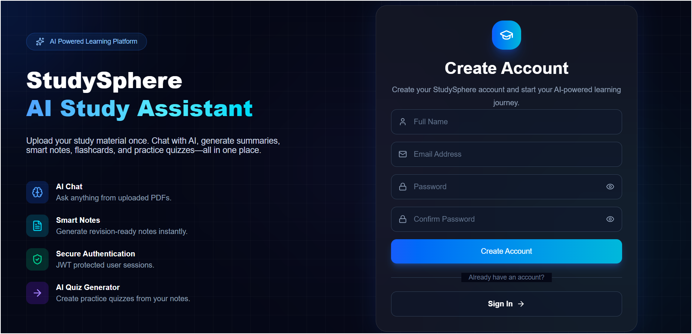
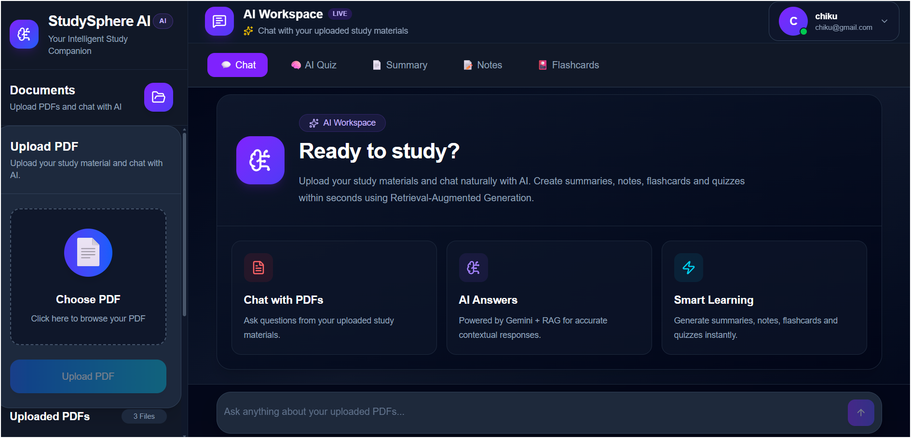
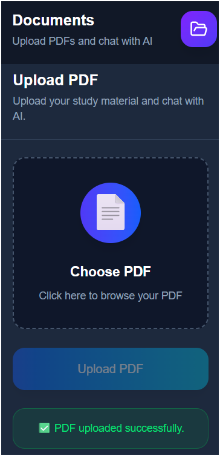
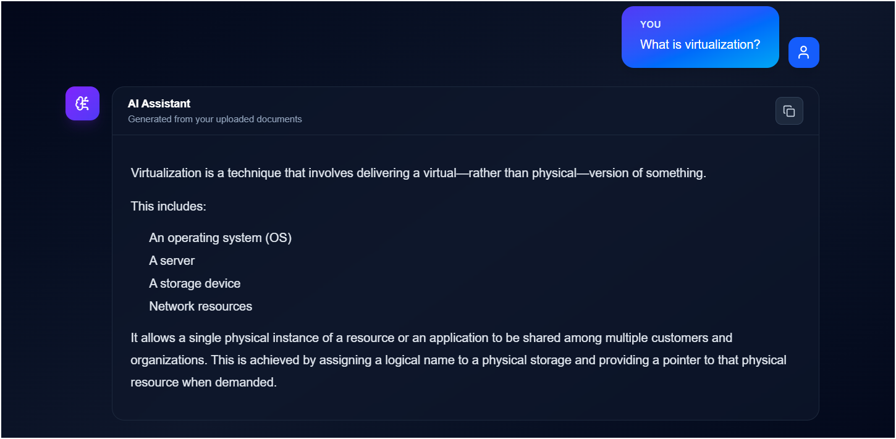
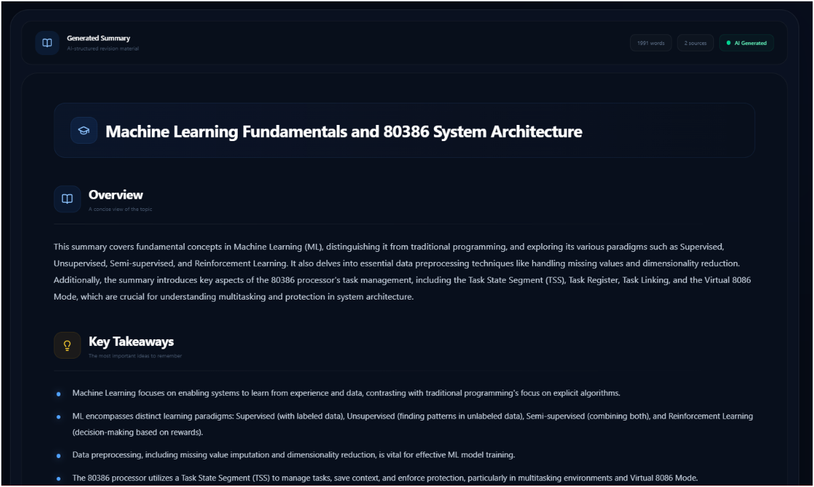
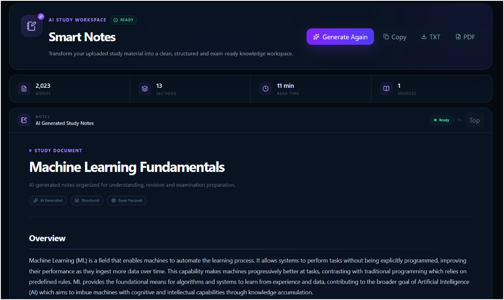
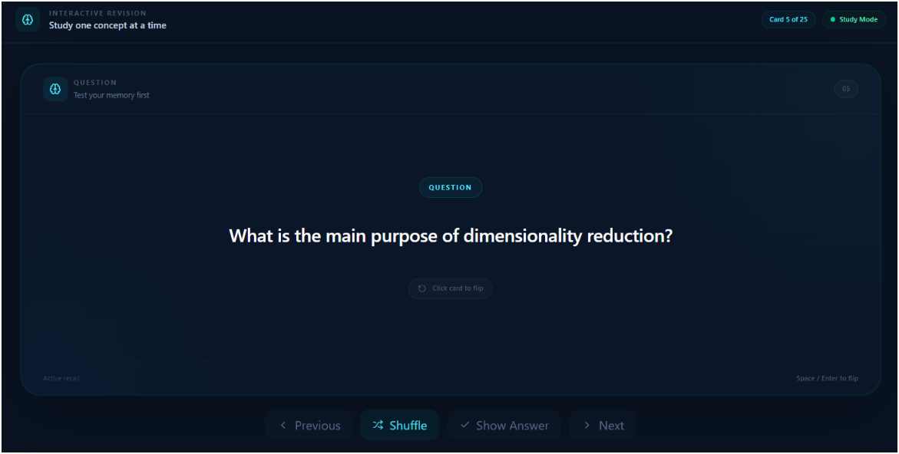
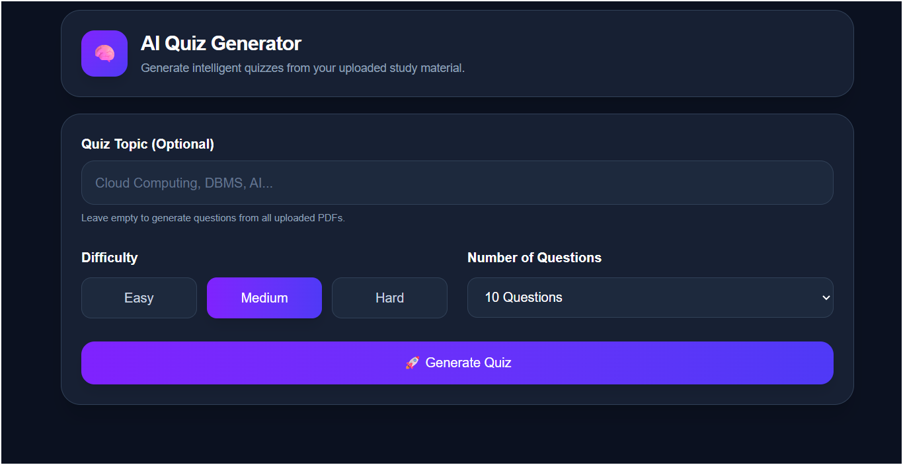
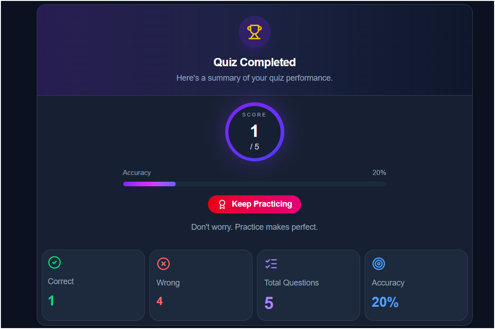

# ✦ StudySphere AI Assistant

### Learn smarter. Revise faster. Understand better.

**StudySphere AI Assistant** is a full-stack, AI-powered learning platform that transforms study PDFs into an interactive learning workspace.

Upload your study material, ask questions, generate summaries and notes, create flashcards, and test your understanding with AI-generated quizzes — all from one application.

<p align="center">

[](https://study-sphere-ai-assistant.vercel.app)
[](https://github.com/jarvissi18/StudySphere-AI-Assistant)
[](LICENSE)

</p>

<p align="center">

**React · FastAPI · RAG · ChromaDB · Sentence Transformers · Google Gemini**

</p>

---

## 🚀 Live Demo

### 🌐 Try StudySphere

**Live Application:**
https://study-sphere-ai-assistant.vercel.app

**Source Code:**
https://github.com/jarvissi18/StudySphere-AI-Assistant

> **Note:** The live frontend is deployed on Vercel. AI functionality requires the configured backend/API services and a valid Gemini API configuration.

---

# 📌 Overview

Studying from large PDF documents often means switching between multiple tools for reading, note-taking, summarization, question generation, and revision.

**StudySphere brings these workflows together into a single AI-powered study environment.**

### The workflow

```text
Upload PDF
    ↓
Extract Text
    ↓
Split into Chunks
    ↓
Generate Embeddings
    ↓
Store in ChromaDB
    ↓
Semantic Retrieval
    ↓
Relevant Context
    ↓
Google Gemini
    ↓
AI-Powered Learning Experience
```

Instead of asking a generic AI model about a topic, StudySphere retrieves relevant information from the uploaded study material before generating the response.

This is the core idea behind its **Retrieval-Augmented Generation (RAG)** architecture.

---

# ✨ Key Features

## 💬 AI Document Chat

Ask natural-language questions about your uploaded study material.

StudySphere uses semantic retrieval to find relevant document sections and provides context-aware answers using Google Gemini.

**Capabilities:**

* Document-grounded Q&A
* Semantic search
* Context-aware responses
* RAG-powered generation
* Natural-language interaction

---

## 📄 Intelligent PDF Processing

Upload PDF study material and convert it into an AI-readable knowledge source.

```text
PDF
 │
 ▼
Text Extraction
 │
 ▼
Text Chunking
 │
 ▼
Embedding Generation
 │
 ▼
ChromaDB
 │
 ▼
Semantic Retrieval
```

This allows the same document to power multiple learning experiences.

---

## 📝 AI Summaries

Convert lengthy study material into concise revision content.

Generated summaries can include:

* Key concepts
* Important points
* Definitions
* Explanations
* Advantages & disadvantages
* Quick revision material

---

## 📚 AI Notes

Generate structured notes from your study material.

Designed for:

* Exam preparation
* Topic-wise revision
* Concept understanding
* Quick learning
* Last-minute revision

---

## 🧠 AI Flashcards

Turn document content into question-and-answer flashcards.

Useful for:

* Active recall
* Self-testing
* Memory retention
* Quick revision

---

## 🎯 AI Quiz Generator

Generate quizzes directly from your study material.

### Quiz experience

* Multiple-choice questions
* Answer selection
* Automatic scoring
* Result review
* Performance feedback

---

## 📊 Quiz Performance

After completing a quiz, StudySphere provides a result-oriented experience so users can review their performance and identify areas that need more revision.

---

## 🔐 Authentication & Security

StudySphere includes an authentication layer designed to protect user-specific functionality.

Implemented security features include:

* User registration
* User login
* JWT-based authentication
* Protected API routes
* Password hashing
* Environment-based secrets
* Frontend-safe API configuration
* `.env` excluded from version control

> Production deployments should additionally implement rate limiting, hardened CORS policies, secure token/cookie strategies, monitoring, logging, and managed secret infrastructure.

---

# 🧠 Retrieval-Augmented Generation

The core intelligence of StudySphere is built around **Retrieval-Augmented Generation (RAG)**.

Traditional LLM applications generate answers primarily from the model's learned knowledge.

StudySphere adds an additional retrieval layer:

```text
                    DOCUMENT INGESTION

                         Upload PDF
                             │
                             ▼
                      Extract Text
                             │
                             ▼
                     Split into Chunks
                             │
                             ▼
                   Generate Embeddings
                             │
                             ▼
                        ChromaDB
                             │
                             │
                    ─────────┼─────────
                             │
                             ▼
                       USER QUESTION
                             │
                             ▼
                   Generate Query Embedding
                             │
                             ▼
                     Semantic Search
                             │
                             ▼
                  Retrieve Relevant Chunks
                             │
                             ▼
                  Build Context + Prompt
                             │
                             ▼
                      Google Gemini
                             │
                             ▼
                  Contextual AI Response
```

### Why RAG?

RAG helps StudySphere focus responses on the information contained within the user's uploaded material rather than behaving like a completely generic chatbot.

The retrieval layer consists of:

* Text extraction
* Document chunking
* Sentence Transformer embeddings
* ChromaDB vector storage
* Semantic similarity search
* Context construction
* Gemini-based generation

---

# 🏗️ System Architecture

```text
┌──────────────────────────────────────────────┐
│                    USER                      │
└──────────────────────┬───────────────────────┘
                       │
                       ▼
┌──────────────────────────────────────────────┐
│              React + Vite Frontend           │
│                 Tailwind CSS                 │
└──────────────────────┬───────────────────────┘
                       │
                  REST / Axios
                       │
                       ▼
┌──────────────────────────────────────────────┐
│                 FastAPI Backend               │
│                                              │
│  Authentication │ PDF Processing │ AI APIs  │
└───────────┬──────────────┬──────────────┬────┘
            │              │              │
            ▼              ▼              ▼
      ┌──────────┐   ┌───────────┐  ┌──────────────┐
      │  SQLite  │   │ ChromaDB  │  │ Google Gemini│
      │   Data   │   │  Vectors  │  │  Generation  │
      └──────────┘   └───────────┘  └──────────────┘
                           ▲
                           │
                    Sentence Transformers
```

---

# 🛠️ Technology Stack

## Frontend

| Technology         | Purpose                |
| ------------------ | ---------------------- |
| **React.js**       | Component-based UI     |
| **Vite**           | Frontend build tooling |
| **Tailwind CSS**   | Responsive styling     |
| **Axios**          | API communication      |
| **React Markdown** | AI response rendering  |
| **jsPDF**          | PDF export             |
| **Lucide React**   | UI icons               |

## Backend

| Technology   | Purpose            |
| ------------ | ------------------ |
| **Python**   | Backend language   |
| **FastAPI**  | REST API framework |
| **Uvicorn**  | ASGI server        |
| **Pydantic** | Data validation    |
| **JWT**      | Authentication     |
| **Passlib**  | Password hashing   |

## AI & Retrieval

| Technology                | Purpose                     |
| ------------------------- | --------------------------- |
| **Google Gemini**         | Generative AI               |
| **Sentence Transformers** | Text embeddings             |
| **ChromaDB**              | Vector database             |
| **RAG**                   | Context-aware AI generation |
| **Semantic Search**       | Relevant document retrieval |

## Data Layer

| Technology   | Purpose                   |
| ------------ | ------------------------- |
| **SQLite**   | Application and user data |
| **ChromaDB** | Document vector storage   |

The repository's current implementation documents these technologies and their respective roles.

---

# 📂 Project Structure

```text
StudySphere-AI-Assistant/
│
├── backend/
│   ├── auth/
│   ├── database/
│   ├── routes/
│   ├── schemas/
│   ├── services/
│   ├── uploads/
│   ├── main.py
│   └── requirements.txt
│
├── frontend/
│   ├── public/
│   ├── src/
│   │   ├── components/
│   │   ├── context/
│   │   ├── pages/
│   │   ├── services/
│   │   └── App.jsx
│   │
│   ├── package.json
│   └── vite.config.js
│
├── docs/
│   ├── login.png
│   ├── register.png
│   ├── dashboard.png
│   ├── upload-pdf.png
│   ├── chat.png
│   ├── summary.png
│   ├── notes.png
│   ├── flashcard.png
│   ├── quiz.png
│   └── quiz-result.png
│
├── .gitignore
├── LICENSE
└── README.md
```

The current repository contains separate `backend`, `frontend`, and `docs` areas, with screenshots covering the main application flows.

---

# 🖥️ Application Screenshots

## 🔐 Authentication

<p align="center">
  
</p>

---

## 📝 Registration

<p align="center">
  
</p>

---

## 🏠 Dashboard

<p align="center">
  
</p>

---

## 📂 PDF Upload

<p align="center">
  
</p>

---

## 💬 AI Document Chat

<p align="center">
  
</p>

---

## 📝 AI Summary

<p align="center">
  
</p>

---

## 📚 AI Notes

<p align="center">
  
</p>

---

## 🧠 AI Flashcards

<p align="center">
  
</p>

---

## 🎯 AI Quiz

<p align="center">
  
</p>

---

## 📊 Quiz Results

<p align="center">
  
</p>

---

# ⚡ Getting Started

## Prerequisites

Make sure you have:

* **Python 3.11+**
* **Node.js**
* **npm**
* **Git**
* **Google Gemini API key**

---

## 1. Clone the Repository

```bash
git clone https://github.com/jarvissi18/StudySphere-AI-Assistant.git

cd StudySphere-AI-Assistant
```

---

# ⚙️ Backend Setup

Navigate to the backend:

```bash
cd backend
```

### Create a virtual environment

```bash
python -m venv venv
```

### Activate the environment

#### Windows

```bash
venv\Scripts\activate
```

#### macOS / Linux

```bash
source venv/bin/activate
```

### Install dependencies

```bash
pip install -r requirements.txt
```

### Configure environment variables

Create:

```text
backend/.env
```

Add:

```env
GEMINI_API_KEY=your_gemini_api_key
SECRET_KEY=your_secret_key
ALGORITHM=HS256
ACCESS_TOKEN_EXPIRE_MINUTES=60
```

### Start the backend

```bash
uvicorn main:app --reload
```

Backend:

```text
http://127.0.0.1:8000
```

FastAPI interactive documentation:

```text
http://127.0.0.1:8000/docs
```

The repository currently documents this local FastAPI development workflow and Swagger endpoint.

---

# 💻 Frontend Setup

Open another terminal:

```bash
cd frontend
```

Install dependencies:

```bash
npm install
```

Start the development server:

```bash
npm run dev
```

Frontend:

```text
http://localhost:5173
```

---

# 🔑 Environment Variables

The backend requires environment configuration for authentication and Gemini access.

Example:

```env
GEMINI_API_KEY=your_gemini_api_key
SECRET_KEY=your_secret_key
ALGORITHM=HS256
ACCESS_TOKEN_EXPIRE_MINUTES=60
```

### 🔒 Security

**Never commit secrets to GitHub.**

Make sure:

```text
.env
```

is included in `.gitignore`.

The application is designed so API credentials are handled through environment configuration rather than being embedded in frontend source code.

---

# 📡 API Overview

The current backend exposes endpoints for authentication, document management, and AI-powered learning workflows.

## Authentication

| Method | Endpoint    | Purpose               |
| ------ | ----------- | --------------------- |
| `POST` | `/register` | Create account        |
| `POST` | `/login`    | Authenticate user     |
| `GET`  | `/auth/me`  | Retrieve current user |

## Documents

| Method   | Endpoint            | Purpose             |
| -------- | ------------------- | ------------------- |
| `POST`   | `/upload`           | Upload PDF          |
| `GET`    | `/files`            | List uploaded files |
| `DELETE` | `/delete-file/{id}` | Delete document     |

## AI

| Method | Endpoint               | Purpose             |
| ------ | ---------------------- | ------------------- |
| `POST` | `/ask`                 | Ask questions       |
| `POST` | `/generate-summary`    | Generate summary    |
| `POST` | `/generate-notes`      | Generate notes      |
| `POST` | `/generate-flashcards` | Generate flashcards |
| `POST` | `/generate-quiz`       | Generate quiz       |

> API routes may evolve. Use the FastAPI Swagger documentation at `/docs` as the runtime API reference.

These endpoints are documented in the current repository.

---

# 🔄 End-to-End User Flow

```text
┌─────────────────────┐
│     User Login      │
└──────────┬──────────┘
           │
           ▼
┌─────────────────────┐
│     Upload PDF      │
└──────────┬──────────┘
           │
           ▼
┌─────────────────────┐
│   Extract Content   │
└──────────┬──────────┘
           │
           ▼
┌─────────────────────┐
│ Generate Embeddings │
└──────────┬──────────┘
           │
           ▼
┌─────────────────────┐
│      ChromaDB       │
└──────────┬──────────┘
           │
           ▼
┌────────────────────────────┐
│    Select Experience       │
│                            │
│ Chat │ Summary │ Notes     │
│ Flashcards │ Quiz          │
└────────────┬───────────────┘
             │
             ▼
      ┌───────────────┐
      │ Gemini + RAG  │
      └───────┬───────┘
              │
              ▼
      ┌───────────────┐
      │  AI Response  │
      └───────────────┘
```

---

# 📊 Current Feature Status

| Feature                  | Status |
| ------------------------ | :----: |
| User Authentication      |    ✅   |
| JWT Authorization        |    ✅   |
| PDF Upload               |    ✅   |
| PDF Processing           |    ✅   |
| Vector Embeddings        |    ✅   |
| ChromaDB Integration     |    ✅   |
| RAG-based AI Chat        |    ✅   |
| AI Summaries             |    ✅   |
| AI Notes                 |    ✅   |
| AI Flashcards            |    ✅   |
| AI Quizzes               |    ✅   |
| Quiz Scoring             |    ✅   |
| Responsive UI            |    ✅   |
| Live Frontend Deployment |    ✅   |

These are aligned with the current feature status documented in the repository.

---

# 🗺️ Roadmap

StudySphere is designed to evolve into a more comprehensive AI learning platform.

### 📚 Learning

* [ ] AI Study Planner
* [ ] Personalized learning paths
* [ ] AI revision scheduler
* [ ] Spaced repetition
* [ ] Learning progress tracking

### 🧠 AI

* [ ] OCR for scanned documents
* [ ] Multi-document conversations
* [ ] AI-generated mind maps
* [ ] Retrieval quality evaluation
* [ ] Personalized AI tutor

### 🖥️ Platform

* [ ] Multi-PDF workspaces
* [ ] Cloud document storage
* [ ] Docker support
* [ ] Production backend deployment
* [ ] Advanced learning analytics

---

# 🔐 Security

StudySphere currently implements foundational application security practices:

* JWT authentication
* Password hashing
* Protected API routes
* Environment-based secrets
* Frontend-safe API configuration
* `.env` excluded from version control

For a larger production deployment, additional infrastructure would be appropriate, including:

* Rate limiting
* Strict CORS configuration
* Secure token/cookie handling
* Centralized logging
* Monitoring
* Secret management
* Production database infrastructure

---

# 🎓 What This Project Demonstrates

StudySphere demonstrates practical implementation of modern **AI + Full-Stack Engineering** concepts.

### AI Engineering

* Retrieval-Augmented Generation
* LLM integration
* Prompt-based generation
* Semantic search
* Vector databases
* Embedding generation
* Document-grounded AI

### Backend Engineering

* REST API development
* FastAPI architecture
* JWT authentication
* Password hashing
* API validation
* Database integration

### Frontend Engineering

* React component architecture
* Vite-based development
* Responsive UI
* API integration
* Markdown rendering
* Client-side application state

### Software Engineering

* Full-stack application architecture
* Environment configuration
* Modular project structure
* Authentication workflows
* AI-powered feature integration
* Deployment workflow

---

# 🚀 Deployment

The frontend application is deployed using **Vercel**.

### Live Application

https://study-sphere-ai-assistant.vercel.app

For local development, the frontend communicates with the FastAPI backend through the configured API URL.

A future production architecture can separate:

```text
Frontend
   ↓
CDN / Edge Deployment
   ↓
FastAPI API
   ↓
Database + Vector Store
   ↓
AI Services
```

---

# 🤝 Contributing

Contributions, ideas, bug reports, and improvements are welcome.

### 1. Fork the repository

```bash
git fork https://github.com/jarvissi18/StudySphere-AI-Assistant
```

Or use GitHub's **Fork** button.

### 2. Create a feature branch

```bash
git checkout -b feature/your-feature
```

### 3. Make your changes

```bash
git add .
```

### 4. Commit

```bash
git commit -m "feat: add your feature"
```

### 5. Push

```bash
git push origin feature/your-feature
```

### 6. Open a Pull Request

Describe what you changed and why.

---

# 📄 License

This project is licensed under the **MIT License**.

See the [LICENSE](LICENSE) file for details.

---

# 👨‍💻 Author

## Swapnil Suryawanshi

**Computer Engineering Student · Full-Stack Developer**

Interested in building practical applications using:

`AI` · `RAG` · `FastAPI` · `React` · `Python` · `Databases`

---

# 🙏 Acknowledgements

Built with the help of these technologies and open-source projects:

* React
* FastAPI
* Vite
* Tailwind CSS
* Google Gemini
* ChromaDB
* Sentence Transformers
* Lucide React

---

# ⭐ Support the Project

If you find StudySphere useful or interesting:

⭐ **Star the repository**

🐛 **Report issues**

💡 **Suggest improvements**

🤝 **Contribute**

---

<p align="center">

### ✦ StudySphere AI Assistant

**Learn smarter. Revise faster. Understand better.**

Built with ❤️ using modern AI and full-stack technologies.

</p>
